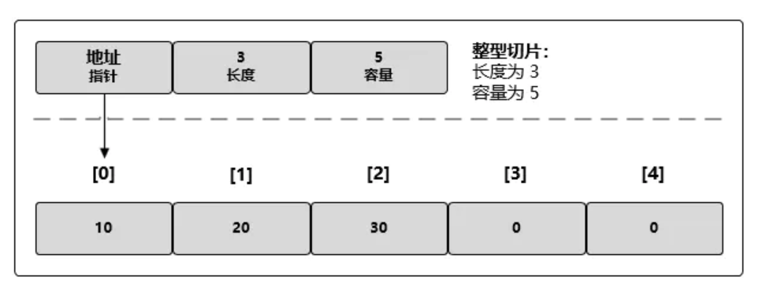

在之前初步了解了golang中的数据结构之后，我们接下来就要了解以下golang中的集合的概念。

比如字符串string的数据，如果你有很多条数据需要反馈出来。你该不会用是逐条去进行处理的吧。就像你去买苹果一样，你买了好几个苹果，商家肯定要给你个塑料袋来装这些苹果。而塑料袋就是我们所需要了解的“集合”这个概念。

在日常的编程中，集合就是方便我们来进行一个批量的操作的。

golang中常用的集合主要是切片和map。

切片slice

可以按需求自动增长和缩小

切片长度可以根据append（）来进行实现扩容和切割

切片的底层是在连续的内存块中分配的，所以切片还能获得索引、迭代以及为垃圾回收优化的好处

切片的底层实现，切片是一个很小的对象

map